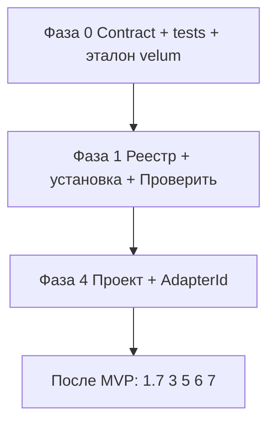
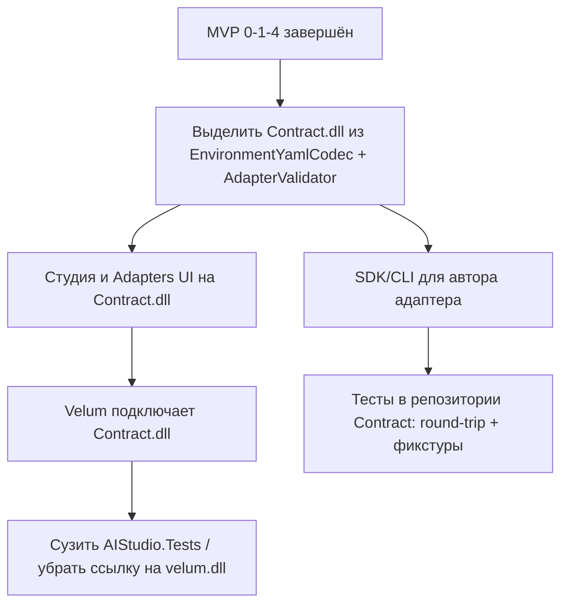

# План доработки AIStudio: платформа адаптеров сред

Документ описывает пошаговую реализацию модели «студия + ISIDA = редактор данных симбионта и сборщик; адаптер = среда (Velum/SolidWorks, Excel, Word…)». Основан на текущем состоянии **`Common\Environment\`** (namespace `AIStudio.Common.SymbiontEnv`) и обсуждении архитектуры (без привязки к `velum.dll` в сборке студии).

**Активный scope документа — укороченный MVP** (версия плана 2.0). Полный продукт (schema-driven UI, мастер пакета, Inno Setup) описан в разделе **«После MVP»** и сохранён для последующих итераций.

---

## Укороченный MVP — цель и границы

### Цель MVP

В одной AIStudio разработчик может:

1. **Зарегистрировать** пакет адаптера (папка или ZIP) → `%ProgramData%\ISIDA\Adapters\{id}\`.
2. **Создать проект симбионта** с выбором адаптера → `AdapterId` в Settings, BootData из **Adapters**, не из захардкоженного VELUM.
3. **Редактировать** гомеостаз, `.dat`, YAML среды и сценарии в проекте **существующими** редакторами («Рецепты среды» / «Триггеры среды» — UI как сейчас, под Velum/SW).
4. **Проверить** совместимость YAML с runtime через контракт и dual round-trip (фаза 0).

Установщик (`dist` + `iscc`), динамический UI по `schema\` и мастер «Собрать пакет адаптера…» — **не входят в MVP**.

### В scope MVP

| Входит | Не входит (после MVP) |
|--------|------------------------|
| `AdapterContract.md`, фикстуры YAML, test project + dual round-trip | Schema-driven редакторы (фаза 3) |
| Реестр Adapters, установка копией, «Проверить» | Мастер 1.7 «Собрать пакет…» |
| `AdapterId`, мастер «Новый проект», BootData из Adapters | «Собрать установщик…», ISS, dist (фаза 5) |
| Блокировка редакторов среды без `AdapterId` | Снятие хардкода Part/Assembly/Drawing в UI |
| Ручная сборка пакета по `AdapterAuthorGuide.md` | Контрактная DLL, `GetMetadata()` в процессе студии (фаза 2) |
| Эталонный пакет `velum` в репо + регистрация в студии | Полная миграция legacy «чужой корень» (только 4.5-lite) |

### Пользовательский цикл (MVP)

1. Собрать host (`bin\Debug`) и **вручную** собрать пакет по AuthorGuide § 6 *(мастер — после MVP)*.
2. **Установить адаптер…** → `Adapters\{id}\`.
3. **Проверить**.
4. **Новый проект симбионта** → выбор адаптера → редактирование данных → виртуальные тесты.
5. Установку у конечного пользователя — **вне студии** (существующий `VelumSetup.iss` / ручное копирование dist).

Коллега: шаги 2–4 по переданному ZIP.

Разработчик адаптера и симбионта — одни и те же пользователи студии; отдельной роли «владелец студии» нет.

**Не в scope MVP:** полная замена рантайма Velum; эмуляция Excel/SW без установленной среды; новые поля в студии вне контракта; сборка установщика из студии.

---

## Роль студии

| Делает студия (MVP) | Не делает студия |
|---------------------|------------------|
| Регистрирует пакет в `Adapters\{id}\`, «Проверить» (manifest, sample YAML, опционально schema JSON) | Не компилирует host; **не** собирает пакет мастером (только ручной путь) |
| Новый проект с `AdapterId`, BootData из Adapters | Не дублирует логику SolidWorks/Office |
| Редактирует данные симбионта (в т.ч. YAML среды **текущим** UI) | Не требует `velum.dll` в bin студии |
| Виртуальные тесты | Не строит dist/ISS; не рисует формы по schema |

Новые поля в YAML для конечного runtime — только через **новую версию пакета адаптера** и обновление контракта; студия в MVP **не** расширяет YAML новыми ключами.

---

## Пакет адаптера (MVP)

### Минимальная структура для «Проверить» и проекта

```
MyAdapter\
  manifest.json              ← ОБЯЗАТЕЛЬНО
  BootData\Environment\      ← ОБЯЗАТЕЛЬНО (sample YAML для проверки и seed проекта)
    EnvironmentRecipes.yaml
    EnvironmentTriggers.yaml
  runtime\                   ← ОБЯЗАТЕЛЬНО для velum; для «только данные» — по AuthorGuide
  schema\                    ← ОПЦИОНАЛЬНО в MVP (нужен для расширенной «Проверить»; UI не читает)
  installer\                 ← ОПЦИОНАЛЬНО (после MVP)
  adapter-settings\          ← ОПЦИОНАЛЬНО
```

**Runtime closure:** в `runtime\` копировать **все** DLL из `bin\Debug` host, без которых среда не стартует (для Velum — в т.ч. `isida.dll` и зависимости), не только `velum.dll`. Зафиксировать в Contract § runtime.

Подробно — `AdapterAuthorGuide.md` § 5–6.

### Регистрация

```
  «Установить адаптер…» → папка или ZIP
       │  полное копирование
       ▼
%ProgramData%\ISIDA\Adapters\{adapterId}\
```

Студия дальше работает **только** с Adapters. Повторная регистрация того же `id` — замена с подтверждением (политика версий — AuthorGuide).

### Проект симбионта и хаб

```
%ProgramData%\ISIDA\Projects\{имя}\
  Settings\Settings.xml     — AdapterId, пути Data/BootData (без InstallerTemplate в MVP)
  Data\, BootData\Environment\, …

%ProgramData%\ISIDA\Settings\AIStudioHub.xml   — открытый проект (без ISCC в MVP)
```

**Новый проект:** `Adapters\{id}\BootData\` → `{project}\BootData\`.

`Settings.xml` в `adapter-settings\` — шаблон host; в проекте — профиль симбионта (см. AuthorGuide).

---

## Текущее состояние (отправная точка)

| Компонент | Статус |
|-----------|--------|
| Редакторы «Рецепты среды» / «Триггеры среды» | Есть, меню «Среда» |
| YAML I/O | `Common\Environment\` — `EnvironmentYamlCodec`, `EnvironmentCatalogStorage`, `EnvironmentPaths` |
| Зависимость от Velum | Снята (`isida.dll` только) |
| Универсальность UI | Частичная: Part/Assembly/Drawing, SW — **остаётся в MVP** |
| Регистрация адаптеров | Нет |
| `AdapterContract.md` | Нет (есть черновик AuthorGuide) |
| Test project YAML | Нет |
| Выбор адаптера в проекте | Нет |
| YAML I/O | Единый `SymbiontEnv.Contract` (студия + Velum + тесты) |

---

## Целевая архитектура (MVP)

```
%ProgramData%\ISIDA\Adapters\{adapterId}\
  manifest.json
  BootData\Environment\
  runtime\                    — не загружается в процесс студии
  schema\                     — опционально; валидация «Проверить», не UI

{корень проекта}\
  Settings\Settings.xml       — AdapterId
  BootData\Environment\       — рабочие YAML проекта
  Data\ ...
```

Студия: `AdapterId` → пути BootData из проекта; редакторы среды пишут YAML в формате **runtime contract** (как сейчас, через `EnvironmentYamlCodec`). Привязка к `Adapters\{id}\` — для происхождения seed и метаданных manifest, **не** для динамических форм.

---

## Согласование YAML (обязательный gate фазы 0)

YAML в Velum и студии — через **`SymbiontEnv.Contract.dll`** (ссылка на сборку, не project в solution студии).

### Шаг 0.A — Канон в `AdapterContract.md`

- Структура `EnvironmentRecipes.yaml` / `EnvironmentTriggers.yaml`.
- **Нормализация при записи** (для round-trip):
  - `detect.kind`: канон `command_before`, `document_saved`; устаревшие алиасы — только при чтении в Velum;
  - `step.type`: канон и алиасы;
  - пустые списки vs отсутствие ключа;
  - `id` / `trigger_key`, `document_kinds` / `document_filter`.
- **Runtime contract** для MVP = фактические ключи Velum v1; **UI schema** в MVP не используется редакторами (документировать для post-MVP).

### Шаг 0.B — Золотые фикстуры и round-trip (**блокер MVP**)

| Где | Что |
|-----|-----|
| `AIStudio\tests\EnvironmentYaml\` | Новый test project; 3–5 эталонных YAML |
| Тест студии | Read → Write → Read через `EnvironmentYamlCodec` |
| Тест Velum | Тот же файл: Velum readers → `EnvironmentYamlWriter` → повторное чтение |
| CI | Один job на оба репо при изменении контракта или кодека |

Без зелёных тестов фаза 1 не считается завершённой.

### Шаг 0.C — «Проверить» (фаза 1, MVP-уровень)

1. manifest, `contractVersion` поддерживается студией;
2. sample YAML парсится codec студии;
3. если есть `schema\` — JSON парсится; **сверка ключей sample ↔ schema не обязательна в MVP** (достаточно парсинга YAML по runtime contract);
4. проверка наличия обязательных файлов пакета (manifest, BootData, runtime для адаптеров с DLL).

---

## Модель настроек (MVP)

- **`AIStudioHub.xml`** — открытый проект; **без** путей ISCC и профиля мастера пакета.
- **`{project}\Settings\Settings.xml`** — профиль симбионта + **`<AdapterId>`** (новое).

| Было | MVP |
|------|-----|
| Пути/данные без привязки к адаптеру | `AdapterId` + BootData из Adapters при создании |
| «Чужой корень» как основной путь | Мастер «Новый проект» — основной; открытие существующего — без обязательной миграции (4.5-lite) |

---

## Фаза 0. Контракт и тесты (5–8 дней)

**Задача:** gate перед кодом Adapters.

### Шаг 0.1 — `docs\AdapterContract.md`

- `manifest.json` (обязательные поля, `contractVersion` 1.0);
- runtime contract YAML (ключи velum v1);
- нормализация (0.A);
- структура пакета MVP vs полного пакета (post-MVP);
- runtime closure (все DLL из bin host).

### Шаг 0.2 — AuthorGuide (синхронизация)

`AdapterAuthorGuide.md` уже есть (черновик): привести § 5–6 к MVP — **ручная** сборка пакета, `schema\`/`installer\` опциональны; сценарий без «Собрать установщик».

### Шаг 0.3 — Разделение уровней данных

| Уровень | Кто задаёт |
|---------|------------|
| ISIDA (Gomeostas, сценарии…) | Студия |
| Каркас YAML (`recipes`, `triggers`, id…) | Контракт |
| Preconditions/detect (part, command_ids…) | Runtime Velum; UI MVP — как сейчас |

### Шаг 0.4 — Test project + фикстуры (0.B)

Создать `AIStudio.Tests.EnvironmentYaml` (или аналог), подключить в solution, CI.

### Шаг 0.5 — Эталон `docs\adapter-package-example\velum\`

Минимальный пакет **в репозитории** (не «из Velum\config как истина»): manifest, BootData, runtime-список в README (DLL копируются при сборке Velum локально). Используется для 1.6 и round-trip.

### Критерий готовности фазы 0

- `AdapterContract.md` v1;
- dual round-trip зелёный на фикстурах;
- AuthorGuide согласован с MVP scope;
- эталонная структура пакета `velum` в docs.

---

## Фаза 1. Каталог адаптеров и регистрация (5–7 дней)

**Задача:** Adapters + установка + проверка. **Без** мастера 1.7.

### Шаг 1.1 — `AdapterPaths.cs`

`%ProgramData%\ISIDA\Adapters`, имена подпапок; не копировать в `AIStudio\bin\Debug`.

### Шаг 1.2 — `AdapterManifest.cs`

Id, DisplayName, Version, ContractVersion, Author, BootDataRelativePath; поля installer/schema — nullable (post-MVP).

### Шаг 1.3 — `AdapterRegistry.cs`

Сканирование, кэш, инвалидация по mtime.

### Шаг 1.4 — UI «Адаптеры»

- Список установленных;
- «Установить адаптер…» → папка/ZIP → полное копирование в `Adapters\{id}\`;
- замена существующего `id` — с подтверждением;
- «Проверить» (0.C);
- «Открыть руководство автора»;
- **Нет** кнопки «Собрать пакет…» в MVP.

### Шаг 1.5 — Валидация «Проверить»

См. 0.C. Без загрузки DLL в процесс студии.

### Шаг 1.6 — End-to-end `velum`

1. Собрать пакет **вручную** из `docs\adapter-package-example\velum` + DLL из `Velum\bin\Debug` (все зависимости).
2. Установить → `Adapters\velum\`.
3. «Проверить» OK.

### Критерий готовности фазы 1

Реестр; установка/проверка; `velum` зарегистрирован; в bin студии нет `velum.dll`.

---

## Фаза 4. Проект симбионта и AdapterId (4–6 дней)

> Выполнять **сразу после** фазы 1. Фаза 3 (schema UI) **не** входит в MVP.

### Шаг 4.1 — `<AdapterId>` в Settings

- Запись при создании проекта; **только чтение** в UI настроек после создания;
- `<InstallerTemplate>` — **не** добавлять в MVP.

### Шаг 4.2 — Мастер «Новый проект»

- Путь под `ISIDA\Projects\` (`ProjectBootstrap`);
- ComboBox из `AdapterRegistry` (только установленные);
- копия `Adapters\{id}\BootData\` → `{project}\BootData\`;
- `EnsureCatalogAt` — seed только если файлов нет;
- записать `AdapterId`.

### Шаг 4.3 — Редакторы среды (MVP)

- Пустой `AdapterId` → блокировка меню «Среда» с сообщением «выберите проект с адаптером»;
- **Не** подключать `AdapterSchemaLoader` к UI;
- пути YAML — из проекта (`EnvironmentPaths` / Settings), как сейчас.

### Шаг 4.4 — Шаблон каталогов

`BootData\Environment\` в `SettingsValidator` / `ProjectBootstrap` (если ещё не везде).

### Шаг 4.5-lite — Открытие существующего проекта

- «Открыть проект» без `AdapterId` — предупреждение + предложение указать адаптер вручную в Settings **или** создать новый проект;
- полная миграция legacy — post-MVP.

### Критерий готовности фазы 4

Новый проект `velum`: BootData из `Adapters\velum`, `AdapterId` в Settings; рецепты/триггеры редактируются; round-trip YAML не ломается на типовых файлах проекта.

---

## Порядок внедрения (MVP)



**MVP:** **0 → 1 → 4** (строго последовательно; фаза 0.B — gate).

**Параллельно с 1:** ручная сборка эталона `velum` по AuthorGuide.

**Оценка MVP:** **~3–4 недели** одного разработчика (с буфером на CI и отладку путей BootData).

---

## Изменения в `AIStudio.csproj`

Каждый новый файл под `Common\Adapters\` — `<Compile>` (проект не SDK-style). Test project — отдельный `.csproj` в solution.

---

## Риски (MVP)

| Риск | Митигация |
|------|-----------|
| Два парсера YAML | 0.B обязателен до релиза MVP |
| UI остаётся под SW | Явно в документации; schema UI — post-MVP |
| Неполный runtime в пакете | Contract § closure; чеклист 1.6 |
| Schema в пакете устарела | В MVP schema не в UI; только опциональная проверка JSON |
| Legacy проекты без AdapterId | 4.5-lite: предупреждение |
| ZIP с path traversal | Post-MVP (7.x) или простая проверка имён в 1.4 |

---

## Чеклист «укороченный MVP выполнен»

- [ ] `AdapterContract.md` v1 + зелёный dual round-trip (0.B)
- [ ] Test project в solution + CI
- [ ] `docs\adapter-package-example\velum` — эталон структуры пакета
- [ ] «Установить адаптер…» → полная копия в `Adapters\{id}`
- [ ] «Проверить»: manifest + BootData YAML (+ опционально schema JSON)
- [ ] Пакет `velum` собран вручную, зарегистрирован, без `velum.dll` в bin студии
- [ ] «Новый проект»: выбор адаптера, BootData из Adapters, `AdapterId` в Settings
- [ ] Редакторы среды работают в проекте с `AdapterId=velum`; без AdapterId — блок
- [ ] AuthorGuide: сценарии A/B **без** мастера пакета и **без** установщика из студии
- [ ] Runtime closure: все нужные DLL из `Velum\bin\Debug` в `Adapters\velum\runtime\`

---

## После MVP (полный продукт)

Сохранённая дорожная карта; порядок как в исходном плане v1.3, **без повторения** деталей фаз 0/1/4.

| Фаза | Содержание | Оценка |
|------|------------|--------|
| **1.7** | Мастер «Собрать пакет адаптера…» (bin → runtime, manifest, schema, BootData, ISS, ZIP, профиль в хабе) | 4–6 дн |
| **3** | Schema-driven редакторы; снять `EnvironmentDocumentKind` из UI; `AdapterSchemaLoader` | 7–12 дн |
| **5** | `ProjectBuildProfile`, dist, ISS, ISCC, `InstallerTemplate` | 6–10 дн |
| **2** | Контрактная DLL / валидатор вне процесса (опционально) | 3–5 дн |
| **6** | AuthorGuide + demo-адаптер, финализация Contract | 1–2 дн |
| **7** | Валидация YAML по schema, tooltips, ZIP export, безопасность | по необходимости |

**Порядок после MVP:** **1.7 → 4 (дополнить InstallerTemplate) → 3 → 5 → 6 → 7**.


**Полный продукт (без фазы 2):** MVP + **~5–7 недель** дополнительно.

### Фаза 3 (кратко, post-MVP)

Schema в пакете; UI только по schema; запись YAML по runtime contract; удаление хардкода SW в XAML; round-trip на `Adapters\velum\BootData`.

### Фаза 5 (кратко, post-MVP)

`ProjectBuildProfile`; dist + `install-manifest.json`; шаблоны `default-symbiont.iss` / `velum`; ISCC в хабе; `BuildVerify-velum.md`.

### Фаза 1.7 (кратко, post-MVP)

`AdapterPackageBuilder` + окно; копирование `*.dll` с опциями; «Зарегистрировать сейчас»; пути в `AIStudioHub.xml`.

---

## Оценка трудозатрат

| Scope | Оценка |
|-------|--------|
| **MVP (фазы 0, 1, 4)** | **15–21 дн** (~3–4 нед) |
| Post-MVP: 1.7 + 3 + 5 + 6 | **~5–7 нед** |
| Полный продукт суммарно | **~8–11 нед** одного разработчика |

---

## После MVP: общая библиотека контракта и тестов (целевая архитектура)

**Статус (2026-06):** реализовано `SymbiontEnv.Contract.dll`. AIStudio и Velum подключают **DLL** (`HintPath` на `SymbiontEnv.Contract\bin\$(Configuration)\`); в `AIStudio.sln` только проект студии. Исходники Contract — отдельный `.csproj` в `app\SymbiontEnv.Contract\` (сборка перед студией).

### Цель

Вынести в **отдельную DLL** (условно `ISIDA.SymbiontEnv.Contract` / `SymbiontEnv.Contract`):

| Компонент | Назначение |
|-----------|------------|
| Нейтральные DTO | Рецепт, триггер, шаг, detect — без типов SolidWorks в публичном API |
| YAML codec | Единственный канон чтения/записи `EnvironmentRecipes.yaml` / `EnvironmentTriggers.yaml` |
| `PackageValidator` | То же, что «Проверить» в студии: manifest, BootData, runtime, schema (warning) |
| Опционально CLI / `dotnet tool` | Локальная проверка пакета **автором адаптера** без AIStudio |

**Потребители:** AIStudio (редакторы + «Проверить»), автор адаптера (SDK/CLI), со временем — runtime host’ы (Velum и др.) вместо дублирующих `VelumRecipeYamlReader` / `EnvironmentYamlWriter`.

### Миграция (порядок)



1. **Создать** `SymbiontEnv.Contract.csproj` (net48, без WPF): перенести codec, правила нормализации § 5 контракта, валидацию пакета.
2. **AIStudio:** `EnvironmentYamlCodec` / `AdapterValidator` → тонкие обёртки или прямые вызовы Contract; UI без изменений поведения.
3. **Автор адаптера:** документировать `Contract.VerifyPackage(path)` в AuthorGuide; пример вызова из PowerShell/cmd.
4. **Velum:** заменить внутренние YAML reader/writer на Contract (отдельная задача Velum); до миграции сохранить T3/T4 в `AIStudio.Tests.EnvironmentYaml`.
5. **Тесты:** перенести фикстуры и round-trip в solution Contract; comparer только по **нейтральным DTO** (без `Velum.ReactiveCore`); cross-host тесты — до полной миграции Velum.
6. **Удалить/упростить** `AIStudio.Tests.EnvironmentYaml` после зелёного CI на Contract + smoke Velum.

### Критерий готовности этапа

- [x] Одна DLL: codec + package validate; версия = `contractVersion` в manifest.
- [x] AIStudio «Проверить» и редакторы среды используют только Contract.
- [ ] Автор может проверить пакет **без** установки студии (CLI или пример с DLL) — API `AdapterPackageValidator.ValidateAndGetExitCode`, см. `SymbiontEnv.Contract\README.md`.
- [ ] Velum на Contract.dll **или** явный dual-test до миграции задокументирован.
- [ ] В студии **нет** project reference на `velum.dll`.

### Оценка

**3–5 дней** (выделение DLL + студия + CLI); **+2–3 дня** миграция Velum и перенос тестов.

Связь с фазой 2 плана (контрактная DLL): этот блок **конкретизирует** post-MVP фазу 2 и перенос тестов; приоритет — после MVP **0 → 1 → 4**.

---

*Версия плана: **2.1** (добавлен блок Contract.dll). Дата: 2026-06-04. MVP: 0 → 1 → 4; пакет вручную; редакторы среды без schema UI; установщик и мастер пакета — после MVP.*
